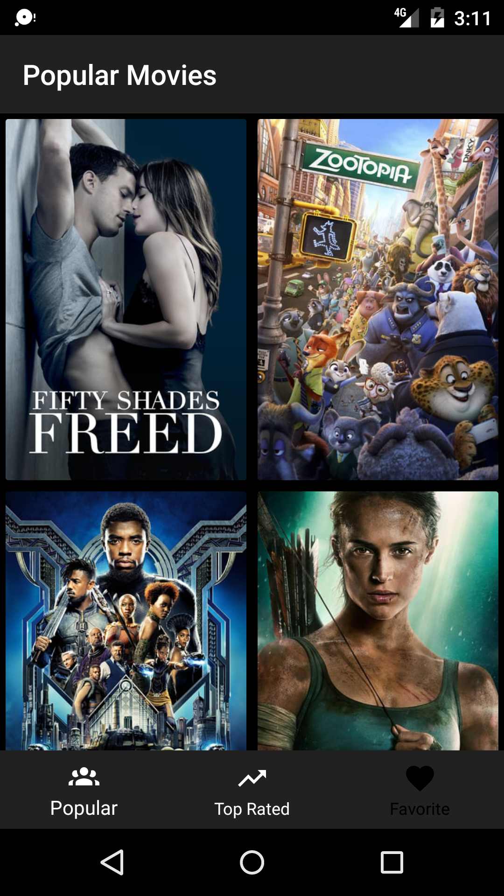
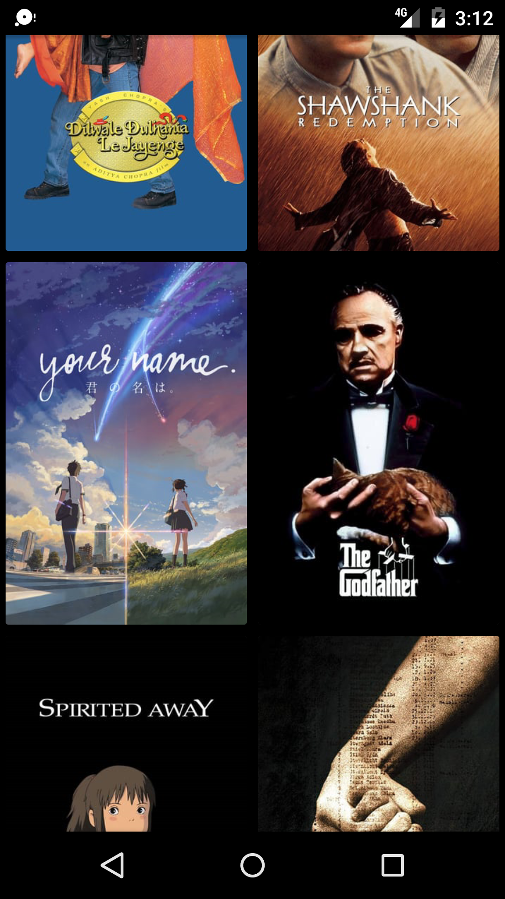
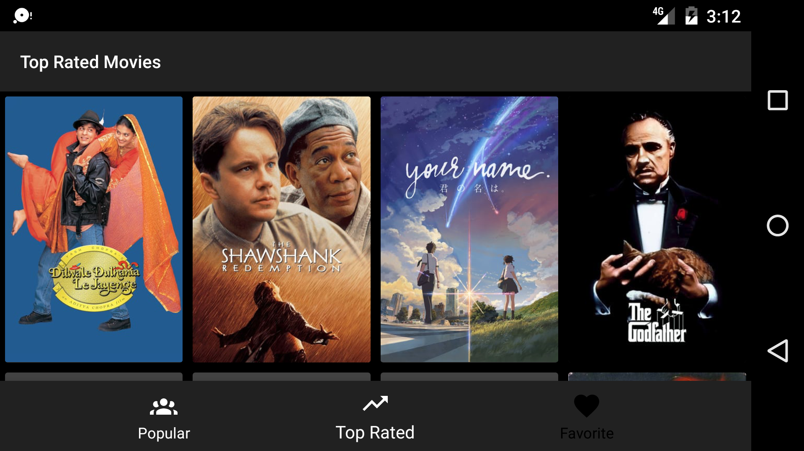
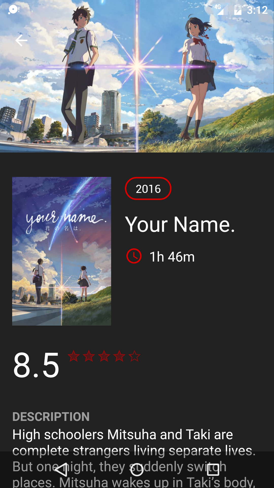

#Sample Movie App
This app shows Latest Movies and their details  Detail page is displayed with poster, title, trailer
 ## Screenshots

 

## Architecture
MVP + RxJava
## Libraries and SDKs Used
- [Android Support Libraries](https://developer.android.com/topic/libraries/support-library/packages.html) 
- [RxJava + RxAndroid](https://github.com/ReactiveX/RxJava)
- [Retrofit](http://square.github.io/retrofit/)
- [Gson](https://github.com/google/gson)
- [Picasso](http://square.github.io/picasso/)
- [Fancy Buttons](https://github.com/medyo/Fancybuttons)
- [Material Rating Bar](https://github.com/DreaminginCodeZH/MaterialRatingBar)
- [Butterknife](http://jakewharton.github.io/butterknife/)

## NOTES
Get your own API key from [here](https://www.themoviedb.org), And then add it to your `gradle.properties`  like this `tmdbApiKey="your-movies-db-api-key"`
